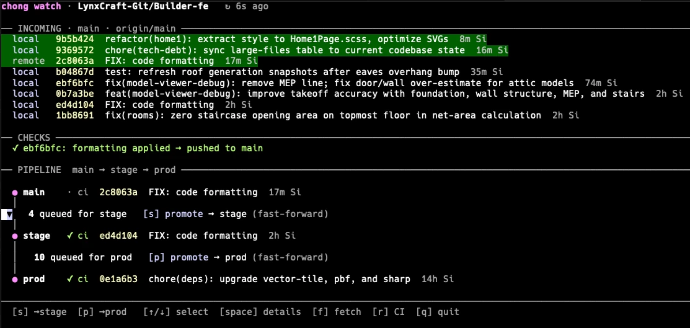

# 冲 chong

> 冲 (chōng) — to push through, to rush forward, to clear the way.

A CLI for watching and managing a git promotion pipeline (main → stage → prod). Works standalone with just git, with optional deeper integration via a Harness account.

## Requirements

- [Bun](https://bun.sh) (runtime + build)
- Git
- `gh` CLI (optional — used for CI status badges and merge operations in `chong watch`)
- `pnpm` in the watched repo (optional — for i18n/format auto-fix in `chong watch`)

## Install

```sh
git clone https://github.com/sesam/chong.git
cd chong
bun run build
ln -sf $PWD/chong ~/bin/chong   # or wherever your $PATH includes
```

---

## Part 1 — works without any account

### `chong watch [<path>] [options]`

Live TUI for your promotion pipeline. Point it at any git repo and it shows commits queuing through your branches, lets you promote between them, and runs automated post-commit checks.

```
Options:
  --branches main,stage,prod   branch names for the pipeline (default: main,stage,prod)
  --interval <seconds>         poll interval (default: 15)
  --remote <name>              git remote (default: origin)
  --format-cmd <cmd>           formatter for shadow auto-fix (default: pnpm format)
  --test-cmd <cmd>             unit-test command for maintenance (default: pnpm test)
  --i18n-cmd <cmd>             i18n command for maintenance (default: pnpm i18n)
  --no-i18n-scan               disable scanning commits for hardcoded (untranslated) strings
```



**TUI keys:** `[s]` promote → stage · `[p]` promote → prod · `[↑/↓]` select · `[space]` queued commits · `[m]` maintenance · `[f]` fetch · `[r]` CI · `[q]` quit

**INCOMING** shows your local branch and remote origin/main commits merged by time. Commits that arrived after `chong watch` started are highlighted green.

**Post-commit checks** run automatically on each new commit (local and remote):
- Flags i18n mismatches: `t()`/`useT`/`i18n` code without `.po`/`.pot` changes, or vice versa
- Flags **hardcoded strings** in the commit's added lines that aren't wrapped in `t()` — copy `pnpm i18n` can't see because it only extracts already-wrapped strings, so it silently stays in the source locale. Scoped to the diff, so it's cheap. Disable with `--no-i18n-scan`.
- Resets a `main-shadow` worktree to origin/main, runs `pnpm i18n`, commits `.po`/`.pot` changes as `FIX: pnpm i18n` and pushes
- Regenerates the lockfile when a commit changed `package.json` but not `pnpm-lock.yaml` (otherwise CI's `--frozen-lockfile` install fails with `ERR_PNPM_LOCKFILE_CONFIG_MISMATCH`); commits as `FIX: pnpm lockfile` and pushes
- Runs the format command on the changed files, commits as `FIX: code formatting` and pushes
- Shows a modal in the TUI if leftover files remain after the i18n fix

**Maintenance** (`[m]`) runs a manual pass in the `main-shadow` worktree:
1. Applies minor (same-major) `pnpm outdated` updates and commits `CLEAN: bump minor deps`
1b. Reconciles `pnpm-lock.yaml` with `package.json` (`pnpm install --lockfile-only`) and commits `FIX: pnpm lockfile` — catches a pre-existing mismatch on origin/main that the per-commit fix never saw
2. Runs the formatter and commits `CLEAN: code style`
3. Runs `pnpm test` — if any unit tests break, shows a short, copy-friendly LLM prompt scoped to just the broken test file(s) (so the LLM can fix and re-run only those, not the whole suite)
4. Runs `pnpm i18n` — if it errors or leaves the tree dirty, shows a copy-friendly LLM prompt to finish the translations
5. Scans the whole tree for hardcoded strings not wrapped in `t()` — if any are found, shows a copy-friendly LLM prompt listing the files/lines so they can be wrapped and translated

Steps 1–2 commit with a `CLEAN:` prefix and push; those commits are skipped by the post-commit checks. The prompts are printed flush-left and color-free so they paste cleanly. Press `[esc]` to return to the pipeline, `[m]` to re-run.

### `chong shadow-work [<path>] [options]`

Manually trigger the same i18n + format checks against the latest origin/main commit — useful for debugging or re-running after a failure.

```
Options:
  --remote <name>       git remote (default: origin)
  --format-cmd <cmd>    formatter command (default: pnpm format)
```

### `chong check i18n [<path>] [--all] [--json]`

List hardcoded, user-facing strings that aren't wrapped in `t()` — the same detection the watch/maintenance flows use, run on demand so you can see the **complete, untruncated** list and tune the heuristic against real output.

```
chong check i18n                      # scan the whole repo, worst files first
chong check i18n src/features/Foo     # scope to a path
chong check i18n --all                # also include skipped non-UI files
chong check i18n --json               # machine-readable
```

Findings are split into two groups, each with its own count: **display components** first — `.vue` SFCs, JSX/TSX, and modules that render UI (the strings a user actually sees) — then **other files** (logic, services, content/data modules).

The heuristic flags string literals / Vue template text carrying a non-source-locale signal (a non-ASCII letter, or a distinctive Slovenian function word) outside a `t(...)` call. By default it skips files that routinely hold non-UI strings — build scripts, tests/specs/stories, fixtures/mocks, type declarations and data files (`*Data.js`, `*-data.ts`, …); `.mjs`/`.md`/`.json`/assets are never scanned. `--all` includes the skipped files.

It's still a candidate flagger, so **expect false positives** (log/throw strings, content/data modules that are intentionally untranslated) — the point is a fast feedback loop for triage, not a fix list.

### How `main-shadow` works

For each new remote commit, chong creates (or resets) a git worktree called `main-shadow` as a sibling of the watched repo:

```
~/projects/
  my-repo/         ← watched repo
  main-shadow/     ← chong's worktree, always at origin/main
```

`node_modules` is symlinked from the source repo (same lockfile, no reinstall). Auto-fix commits are tagged `FIX:` and skipped on re-check to avoid loops.

---

## Part 2 — additional features with a Harness account

[Harness](https://harness.io) has a free tier. These commands integrate with its git backend for change-list tracking, squash-merge workflows, and AI commit coaching.

### `chong auth login`
Save your Harness server URL and personal access token to `~/.chong/auth.json`.
Requires a PAT with repo + pull-request scope.

### `chong new "<title>" [--repo <name>]`
Create a change-list: makes a branch + worktree off the latest main and registers it with Harness.

### `chong upload`
Format, push, and squash-merge the current change-list to main via Harness.

### `chong status`
List your open change-lists (local worktrees + Harness remote).

### `chong abandon [<id>]`
Drop a change-list — removes the worktree, branch, and Harness record.

### `chong history [--repo <name>] [--author <user>]`
Recent commits on main, fetched from Harness.

### `chong show <sha|--latest> [--repo <name>]`
Show a commit with its diff and AI coaching notes from Harness.

---

## Development

```sh
bun run build      # compile binary
bun run lint       # biome check
bun run lint:fix   # biome check --write
```

### Auto-rebuild on commit (optional)

A tracked `post-commit` hook in `.githooks/` recompiles `./chong` after every commit, so a binary you've symlinked onto your `$PATH` stays in sync with the source. Enable it once per clone:

```sh
git config core.hooksPath .githooks
```

The hook finds `bun` via `$PATH` (falling back to `~/.bun/bin`, Homebrew, or `/usr/local/bin`) — no machine-specific paths. To opt out, run `git config --unset core.hooksPath`.

### Atomic-commit guard for agents (optional)

When several agents share one worktree, a stray `git commit` can sweep up another agent's staged changes. Two guards address this:

- `git config core.hooksPath .githooks` enables a tracked `pre-commit` hook that blocks porcelain `git commit` (use `chong commit` instead, or `CHONG_ALLOW_COMMIT=1 git commit …` to override).
- A tracked Claude Code hook at `.claude/hooks/git-guard.ts` nudges agents toward `chong commit` whenever they run `git add`/`reset`/`rm`/`commit`. It's opt-in so it never auto-applies to a teammate's setup — enable it by adding this to your `.claude/settings.json` (or `settings.local.json`):

```json
{
  "hooks": {
    "PreToolUse": [
      {
        "matcher": "Bash",
        "hooks": [
          { "type": "command", "command": "bun \"$CLAUDE_PROJECT_DIR/.claude/hooks/git-guard.ts\"" }
        ]
      }
    ]
  }
}
```
