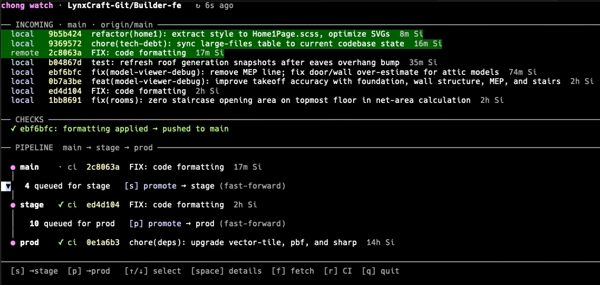

# 冲 chong

> 冲 (chōng) — to push through, to rush forward, to clear the way.

A CLI for watching and managing a git promotion pipeline (main → stage → prod). Works standalone with just git, with optional deeper integration via a Harness account.

## Requirements

- [Bun](https://bun.sh) (runtime + build)
- Git
- `gh` CLI (optional — used for CI status badges and merge operations in `chong watch`)
- `pnpm` in the watched repo (optional — for i18n/format auto-fix in `chong watch`)
- Coding agent (optional — cherry-pick / i18n auto-resolve): prefer `mcpify-agent` from the mcp-ify repo’s `offline-agent/` (offline Ollama; see that repo’s README), else Cursor `agent` / `cursor-agent`

## Install

```sh
git clone https://github.com/sesam/chong.git
cd chong
bun run build
ln -sf $PWD/chong ~/bin/chong   # or wherever your $PATH includes
```

---

## Part 1 — works without any account

### `chong watch [<path>] [options]`

Live TUI for your promotion pipeline. Point it at any git repo and it shows commits queuing through your branches, lets you promote between them, and runs automated post-commit checks.

```
Options:
  --branches main,stage,prod   branch names for the pipeline (default: main,stage,prod)
  --interval <seconds>         poll interval (default: 15)
  --remote <name>              git remote (default: origin)
  --format-cmd <cmd>           formatter for shadow auto-fix (default: pnpm format)
  --test-cmd <cmd>             unit-test command for maintenance (default: pnpm test)
  --i18n-cmd <cmd>             i18n command for maintenance (default: pnpm i18n)
  --no-i18n-scan               disable scanning commits for hardcoded (untranslated) strings
  --no-import-scan             disable the unresolved-import gate before stage deploy
  --no-agent                   disable mcpify-agent / cursor-agent for conflicts / i18n
  --no-auto-maintain           disable scheduled commit-producing maintain
  --no-auto-deploy-stage       disable local app-ci deploy cooldown (FRONTEND)
  --deploy-cooldown <seconds>  quiet window on origin/main before stage deploy (default 60)
  --stage-deploy-cmd <cmd>     override deploy command (default: CI=true FORCE=1 DEPLOY_SKIP_INSTALL=1 DEPLOY_S3_TOOL=aws ./scripts/deploy-frontend.sh ci)
```



**TUI keys:** `[s]` deploy → app-ci (local) · `[p]` promote → prod · `[↑/↓]` select · `[space]` queued commits · `[m]` maintenance · `[f]` fetch · `[r]` CI · `[q]` quit

**INCOMING** shows your local branch and remote origin/main commits merged by time. Commits that arrived after `chong watch` started are highlighted green.

**Local → origin inject:** when local `main` has commits that aren't on `origin/main` (plain push if linear, or cherry-pick onto the clean `main-shadow` worktree when histories have diverged), watch lands them automatically. On cherry-pick conflict, the coding agent (`mcpify-agent` if on PATH, else `cursor-agent --model auto`) is asked for a `VERDICT: SAFE|UNSAFE`; only SAFE runs get an auto-resolve attempt. Failures stay a yellow warning and leave origin untouched.

**Partial cherry-pick guard:** if a diverged cherry-pick applies only *some* hunks (others already on origin) the resulting commit gets a new `git patch-id`, so `git cherry` still lists the local SHA as unique. Watch would otherwise re-inject that SHA on every poll and flood `origin/main` with duplicate hunks. After each cherry-pick, watch requires the new commit's patch-id to match the source; on mismatch (or empty skip) it aborts without pushing and blocks those SHAs until the local tip moves.

**Unresolved-import gate (before every stage deploy):** the shadow worktree is scanned for import specifiers that resolve to no file, and any finding blocks the deploy. This exists because a **lazy** `import()` is only resolved when its chunk is first requested — so `vite build` succeeds and the route renders a blank page on navigation. Neither the build nor the unit tests catch it. Scanning is repo-wide rather than diff-scoped on purpose: the commit that breaks things deletes file A, while the dangling import sits in file B, which the diff never mentions. ~0.5s on a 1,700-file repo. Aliases come from the watched repo's `tsconfig.json`/`jsconfig.json` `paths` (falling back to `@/* -> src/*`); comments are stripped first, so `import('@/…')` written as prose in a doc comment is not a finding. Bare package names, template-hole specifiers and URLs are left alone. No auto-fix and no agent hand-off — the repair is either restoring the deleted file or deleting its importer, and guessing wrong ships the wrong one. Disable with `--no-import-scan`.

**Per-repo config (`<repo>/.chong/config.json`):** chong keeps its per-repo state in
`<repo>/.chong/`, and `chong watch` creates that folder and adds `.chong/` to the repo's
`.gitignore` on attach (idempotent; it never rewrites an existing rule). The rule ignores
machine-local state but **not** `config.json` — `.chong/` holds both, and a blanket ignore
would mean every fresh clone silently lost the repo's deploy settings:

```gitignore
.chong/
!.chong/config.json
```

Two keys affect deploys:

```json
{
  "stageDeployCmd": "npm run deploy:stage",
  "stageDeployedShaBucket": "my-ci-static-bucket"
}
```

- `stageDeployCmd` — overrides detection. Resolution order is this key, then the watched
  repo's own `deploy:stage` npm script, then LynxCraft FRONTEND's `scripts/deploy-frontend.sh`.
  Null when the repo says nothing about deploying: a wrong deploy command is worse than none.
- `stageDeployedShaBucket` — where to write the `deployed-git-sha.txt` marker. **Omit it and
  no marker is written.** This used to be a hardcoded LynxCraft bucket written on every
  successful deploy, so watching a second repo overwrote FRONTEND's marker with the other
  repo's SHA — and FRONTEND's stage CI reads that marker to decide whether it can no-op, so
  it would skip a deploy it should have run.

Note that detecting `deploy:stage` enables the manual `[s]` key but does **not** arm
*auto*-deploy; that still needs `stageDeployCmd`/`--stage-deploy-cmd` or the FRONTEND
script. Unattended deploys of a backend are a bad default: in a serverless repo whose
secrets live in CI, a laptop `deploy:stage` can silently replace live environment variables
with blanks and still report success.

**Auto-deploy → app-ci (stage):** when `scripts/deploy-frontend.sh` exists (LynxCraft FRONTEND), watch no longer pushes `origin/stage`. Instead, after origin/main is quiet for **60s** (resets on each new commit), it builds+uploads to the CI S3/CloudFront bucket from `main-shadow`, advances the **local** `stage` branch to that tip (tracking only), writes `deployed-git-sha.txt`, and pings Discord. Manual `[s]` deploys immediately. Prod promote (`[p]`) still pushes git (local stage tip → `prod`) so the full prod CI suite runs. Disable with `--no-auto-deploy-stage`; tune with `--deploy-cooldown <s>` / `--stage-deploy-cmd <cmd>`.

**Offline agents:** install mcp-ify’s `offline-agent` (`bash offline-agent/install.sh`) so `mcpify-agent` is on PATH — then watch runs fully locally via Ollama + mcp-ify with no Cursor cloud dependency.

**Auto-maintain (commit steps only):** runs once when watch starts, then every **20** remote commits or every **2 hours** — deps bump, lockfile reconcile, and format (pushed to `origin/main`). Background notices only (no maintain screen). Full diagnostics stay on `[m]`.

Dep bumps respect **`minimumReleaseAge`** from the watched repo's `pnpm-workspace.yaml` (default 48h if unset). Chong only auto-applies a same-major bump when the target version is **aged out**, or when it is **fresh but vetted** (SLSA provenance, staged publish, or trusted publisher + provenance). Fresh releases that are merely npm-signed — without provenance — are skipped until they age out. pnpm's own `minimumReleaseAge` / `trustPolicy` settings apply on `pnpm install`.

**Post-commit checks** run automatically on each new commit (local and remote):
- Flags i18n mismatches: `t()`/`useT`/`i18n` code without `.po`/`.pot` changes, or vice versa
- Flags **hardcoded strings** in the commit's added lines that aren't wrapped in `t()` — copy `pnpm i18n` can't see because it only extracts already-wrapped strings, so it silently stays in the source locale. Scoped to the diff, so it's cheap. Disable with `--no-i18n-scan`.
- Resets a `main-shadow` worktree to origin/main, runs `pnpm i18n`, commits `.po`/`.pot` changes as `FIX: pnpm i18n` and pushes
- If `pnpm i18n` **fails** (empty `msgstr`, identical en/sl, etc.), asks the coding agent (`cursor-agent --model auto` or `mcpify-agent`) after a SAFE confidence gate; on success commits `FIX: i18n (agent)` and pushes. Uncertain/UNSAFE pauses post-commit i18n auto-fix for 2h
- Regenerates the lockfile when a commit changed `package.json` but not `pnpm-lock.yaml` (otherwise CI's `--frozen-lockfile` install fails with `ERR_PNPM_LOCKFILE_CONFIG_MISMATCH`); commits as `FIX: pnpm lockfile` and pushes
- Runs the format command on the changed files, commits as `FIX: code formatting` and pushes
- Leftover non-.po files after a successful i18n run: coding agent may fix when SAFE; otherwise pauses i18n auto-fix for 2h
- **Auto-deploy → app-ci:** after post-commit fixes, arms a 60s quiet-window on origin/main tip, then runs the local stage deploy (no `stage` branch push). Prod stays a manual git promote (`[p]`).

**Maintenance** (`[m]`) runs a manual pass in the `main-shadow` worktree:
0. Injects any local `main` commits onto `origin/main` first (same as the watch auto-inject), so maintain starts from a tip that already includes them
1. Applies minor (same-major) `pnpm outdated` updates and commits `CLEAN: bump minor deps` (pushed immediately)
1b. Reconciles `pnpm-lock.yaml` with `package.json` (`pnpm install --lockfile-only`) and commits `FIX: pnpm lockfile` — catches a pre-existing mismatch on origin/main that the per-commit fix never saw (pushed immediately)
2. Runs the formatter and commits `CLEAN: code style` (pushed immediately)
3. Runs `pnpm test` — if any unit tests break, shows a short, copy-friendly LLM prompt scoped to just the broken test file(s) (so the LLM can fix and re-run only those, not the whole suite)
4. Runs `pnpm i18n` — if it errors or leaves the tree dirty, asks the coding agent when confident; else pauses post-commit i18n auto-fix for 2h and shows a copy prompt
5. Scans the whole tree for hardcoded strings not wrapped in `t()` — same agent gate as step 4

Steps 1–2 commit with a `CLEAN:`/`FIX:` prefix and push so `origin/main` never goes stale mid-maintain. Those commits are skipped by the post-commit checks. The prompts are printed flush-left and color-free so they paste cleanly. Press `[esc]` to return to the pipeline, `[m]` to re-run.

### `chong shadow-work [<path>] [options]`

Manually trigger the same i18n + format checks against the latest origin/main commit — useful for debugging or re-running after a failure.

```
Options:
  --remote <name>       git remote (default: origin)
  --format-cmd <cmd>    formatter command (default: pnpm format)
```

### `chong check i18n [<path>] [--all] [--json]`

List hardcoded, user-facing strings that aren't wrapped in `t()` — the same detection the watch/maintenance flows use, run on demand so you can see the **complete, untruncated** list and tune the heuristic against real output.

```
chong check i18n                      # scan the whole repo, worst files first
chong check i18n src/features/Foo     # scope to a path
chong check i18n --all                # also include skipped non-UI files
chong check i18n --json               # machine-readable
```

Findings are split into two groups, each with its own count: **display components** first — `.vue` SFCs, JSX/TSX, and modules that render UI (the strings a user actually sees) — then **other files** (logic, services, content/data modules).

The heuristic flags string literals / Vue template text carrying a non-source-locale signal (a non-ASCII letter, or a distinctive Slovenian function word) outside a `t(...)` call. By default it skips files that routinely hold non-UI strings — build scripts, tests/specs/stories, fixtures/mocks, type declarations and data files (`*Data.js`, `*-data.ts`, …); `.mjs`/`.md`/`.json`/assets are never scanned. `--all` includes the skipped files.

It's still a candidate flagger, so **expect false positives** (log/throw strings, content/data modules that are intentionally untranslated) — the point is a fast feedback loop for triage, not a fix list.

### How `main-shadow` works

For each new remote commit, chong creates (or resets) a git worktree called `main-shadow` as a sibling of the watched repo:

```
~/projects/
  my-repo/         ← watched repo
  main-shadow/     ← chong's worktree, always at origin/main
```

`node_modules` is symlinked from the source repo (same lockfile, no reinstall). Auto-fix commits are tagged `FIX:` and skipped on re-check to avoid loops.

### Deploy trust boundary

`chong watch` can deploy stage and prod from your laptop, and can run an AI agent that
commits and pushes. Most of what follows is deliberate, but read it before you point
chong at a repo whose contributors you do not trust.

**The deploy inherits your whole environment.** The deploy command runs with your full
`process.env` — AWS credentials included. It has to: the build reads an open-ended set of
`VITE_*` vars from `.env`, and an allowlist that misses one does not fail loudly, it ships
a build with a feature silently disabled. The consequence is that any script the deploy
invokes runs with your credentials, so a compromised build script in a watched worktree
can exfiltrate them.

**Commit access to a watched repo is code execution as you.** Not "could become" —
is. chong's job is to run the repo's own deploy script, so it runs repo-controlled code
by design. For a repo containing `scripts/deploy-frontend.sh` that is armed
automatically on a ~60s cooldown with no keypress, and the script itself is committed
and unvalidated. `.chong/config.json` is committed too (the ignore rule is `.chong/*`
plus `!.chong/config.json`, so a colleague gets the same behaviour with no setup), and
its `stageDeployCmd` / `prodDeployCmd` are passed to `bash -c`.

Commands coming from that config are rejected if they contain a shell metacharacter
(semicolon, pipe, ampersand, `$`, backtick, parentheses, angle brackets) or a newline.
Be clear about what that is worth: it stops shell *syntax*, not code execution. `bash
.ci/deploy.sh` and `BASH_ENV=./tools/x.sh bash -c :` contain no forbidden character and
both work. It is defence-in-depth against a careless or noisy config, not a boundary —
and it guards the weaker path, since an attacker would edit the deploy script rather
than the config.

The thing that actually bounds the damage, if you want it bounded, is a scoped
credential: run deploys under a dedicated `AWS_PROFILE` with write access only to the
deploy buckets, instead of inheriting your whole environment. That is not done here.
Until it is, treat pointing chong at a repo as granting that repo's contributors your
shell and your credentials, and watch only repos whose commit access you already trust.

**Deploy claims are advisory.** The S3 claim markers that stop two watches deploying at
once are cooperative, not enforced: there are no conditional writes, so anyone with write
access to the marker bucket can force or spoof a claim, and CI / `deploy-frontend.sh`
bypass claims entirely. They prevent accidents between colleagues, not deliberate races.

**The auto-fix agent is fenced, but it still commits.** The i18n/eslint agent is prompted
with repo-authored text (`.po` msgids, string literals, eslint messages), so that text is
wrapped as untrusted data and the agent runs with a scrubbed environment — no `AWS_*`, no
`*_TOKEN` — because unlike the deploy it has no reason to see them. It does still edit the
shadow worktree and push to `main` unattended, and prompt fencing is mitigation rather
than proof, so `--no-agent` is the switch if you would rather it did not.

---

## Part 2 — additional features with a Harness account

[Harness](https://harness.io) has a free tier. These commands integrate with its git backend for change-list tracking, squash-merge workflows, and AI commit coaching.

### `chong auth login`
Save your Harness server URL and personal access token to `~/.chong/auth.json`.
Requires a PAT with repo + pull-request scope.

### `chong new "<title>" [--repo <name>]`
Create a change-list: makes a branch + worktree off the latest main and registers it with Harness.

### `chong upload`
Format, push, and squash-merge the current change-list to main via Harness.

### `chong status`
List your open change-lists (local worktrees + Harness remote).

### `chong abandon [<id>]`
Drop a change-list — removes the worktree, branch, and Harness record.

### `chong history [--repo <name>] [--author <user>]`
Recent commits on main, fetched from Harness.

### `chong show <sha|--latest> [--repo <name>]`
Show a commit with its diff and AI coaching notes from Harness.

---

## Development

```sh
bun run build      # compile binary
bun run lint       # biome check
bun run lint:fix   # biome check --write
```

### Auto-rebuild on commit (optional)

A tracked `post-commit` hook in `.githooks/` recompiles `./chong` after every commit, so a binary you've symlinked onto your `$PATH` stays in sync with the source. Enable it once per clone:

```sh
git config core.hooksPath .githooks
```

The hook finds `bun` via `$PATH` (falling back to `~/.bun/bin`, Homebrew, or `/usr/local/bin`) — no machine-specific paths. To opt out, run `git config --unset core.hooksPath`.

### Atomic-commit guard for agents (optional)

When several agents share one worktree, a stray `git commit` can sweep up another agent's staged changes. Two guards address this:

- `git config core.hooksPath .githooks` enables a tracked `pre-commit` hook that blocks porcelain `git commit` (use `chong commit` instead, or `CHONG_ALLOW_COMMIT=1 git commit …` to override).
- A tracked Claude Code hook at `.claude/hooks/git-guard.ts` nudges agents toward `chong commit` whenever they run `git add`/`reset`/`rm`/`commit`. It's opt-in so it never auto-applies to a teammate's setup — enable it by adding this to your `.claude/settings.json` (or `settings.local.json`):

```json
{
  "hooks": {
    "PreToolUse": [
      {
        "matcher": "Bash",
        "hooks": [
          { "type": "command", "command": "bun \"$CLAUDE_PROJECT_DIR/.claude/hooks/git-guard.ts\"" }
        ]
      }
    ]
  }
}
```
